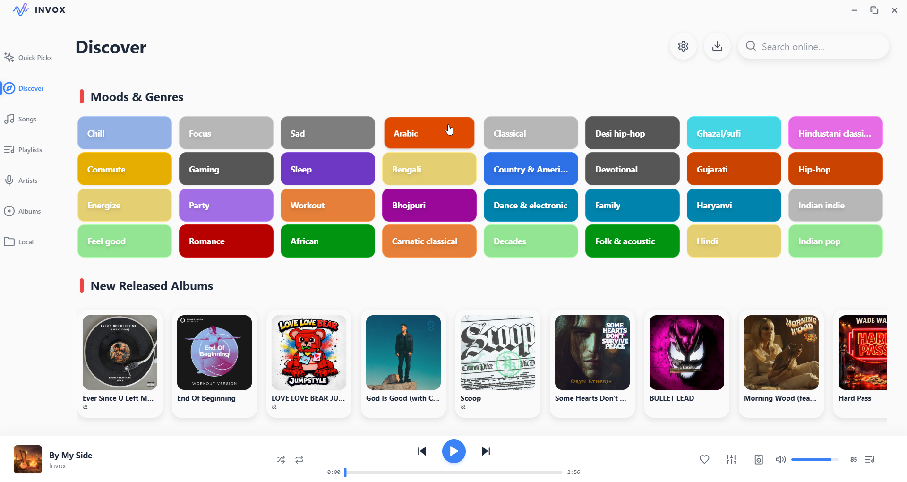
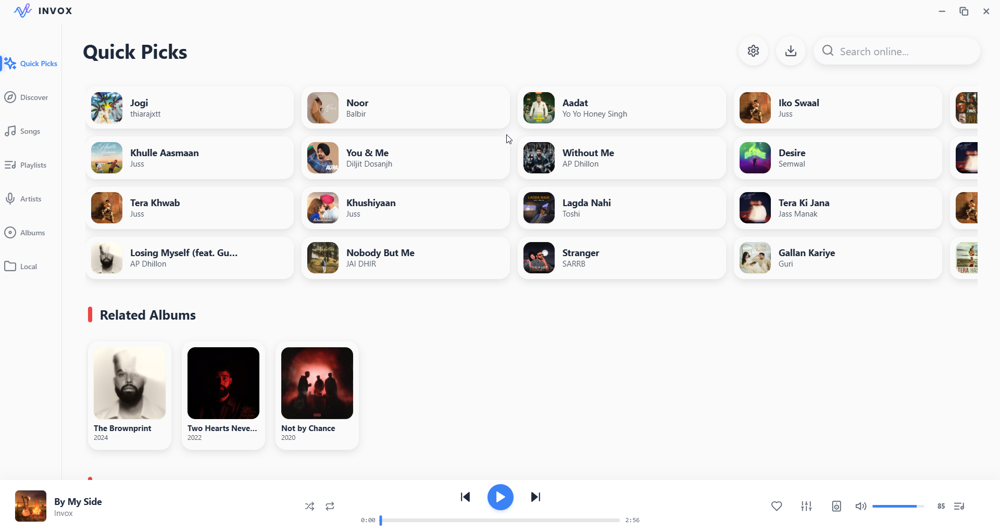
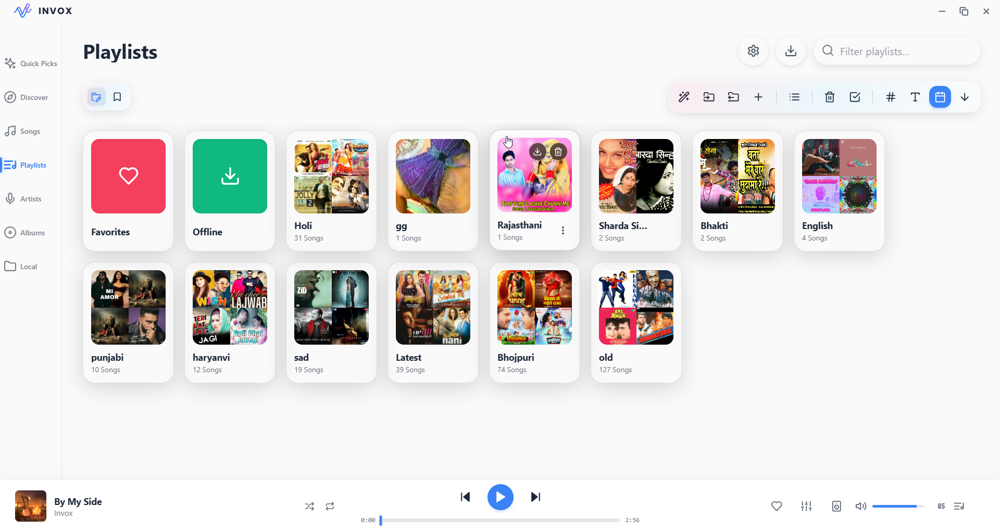
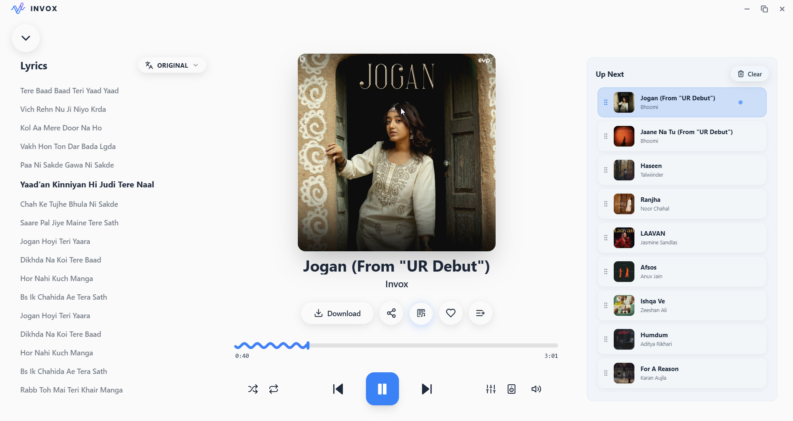
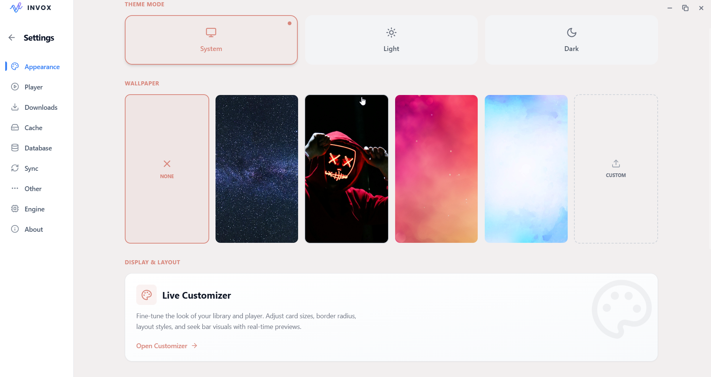

  
  <h1>Invox</h1>
  <b>The ultimate desktop music engine. Seamlessly mix local files and cloud streams with smart playlists, synced lyrics, and a stunning dynamic UI.</b>
    
  

---

Invox is a powerful desktop audio player engineered with a high-performance **C++/Qt backend** and a beautiful, dynamic **React frontend**. Designed for audiophiles and music curators, it effortlessly merges your local files with cloud streaming to create a unified, uninterrupted listening experience.

## 🪄 The Crown Jewel: Magic Playlist Importer
Forget manually searching for hundreds of songs. Invox features a custom-built, highly intelligent **Text-to-Playlist Engine**. 

Just click the **Magic Wand** icon in the Playlist toolbar, choose your `.txt` file, and let Invox do the heavy lifting:
* **The Text File Trick:** Create a simple `.txt` file with a serial list of the songs you want. Drop it into Invox, and the C++ backend will automatically strip out numbering (e.g., "1.", "02 -"), noise characters, and formatting.
* **Auto-Discovery:** The engine instantly searches the cloud for every cleaned track name and automatically compiles them into a fully playable, ready-to-download playlist.
* **Frictionless Management:** Drag, drop, and reorganize massive hybrid queues (mixing local `.mp3`s and streamed tracks) in milliseconds.

## 📥 Ultimate Download & Conversion Engine
Invox features a built-in, multi-threaded download manager designed for music hoarders:
* **Format Conversion:** Download tracks or entire albums and convert them on-the-fly to **MP3, FLAC (Lossless), WAV, AAC, M4A, or OPUS**.
* **Batch Container Downloads:** Download massive playlists or an artist's entire discography with one click.
* **Metadata Mastery:** Automatically embeds high-resolution album artwork, artist data, and track information directly into the downloaded files.

---

## ✨ Full Feature Overview

### 🎶 Music Discovery & Management
* **YouTube Music integration** for discovering trending and personalized content.
* **Advanced search** with intelligent suggestions and filters.
* **Browse pages** with curated playlists, albums, and recommendations.
* **Artist and album pages** with complete metadata.
* **Playlist management** - create, edit, and organize collections.
* **Local library support** for managing downloaded content alongside streams.

### 🎚️ Advanced Audio Processing
* **10-band professional equalizer** with ISO frequencies.
* **Preset library** (Bass Boost, Voice, Pop, Rock, etc.).
* **Spatial audio effects**:
  * 8D Audio (Auto-Pan).
  * SOFA-based HRTF processing.
  * 3D spatial effects.
  * Virtualization controls.
* **Reverb effects** with multiple presets.
* **Audio normalization** and intelligent silence skipping.
* **Bass boost and customization**.
* **Real-time filter chain generation**.

### 📝 Lyrics & Translations
* **Synchronized lyrics** from multiple sources (LrcLib, KuGou).
* **Real-time lyric display** with playback synchronization.
* **Multi-language support** for lyrics.
* **Automatic lyrics fetching** based on song metadata.
* **Built-in translation service** for instant translation of lyrics.

### 🎨 User Interface
* **Modern, responsive design** built with React 18 and Tailwind CSS.
* **Real-time color picker** for the progress bar (supports wavy and normal styles).
* **Dark/Light mode support**.
* **Smooth animations** with Framer Motion.
* **Keyboard shortcuts** for power users.
* **Responsive layout** that works beautifully on any screen size.
* **Customizable appearance settings** via the Live Customizer.

---

## 📸 Screenshots

| Discovery | Home Dashboard |
|:---:|:---:|
|  |  |

| The Playlist Creator | The Player & Lyrics |
|:---:|:---:|
|  |  |

| Settings & Live Customizer |
|:---:|
|  |

---

## 🚀 Download & Installation (Windows)
1. Click the vibrant **Download** button at the top of this page, or navigate to the **[Releases](../../releases)** tab.
2. Download the latest `Invox-Setup.exe`.
3. Run the installer and follow the prompts.
4. Launch Invox and start building your ultimate playlist!

---

## 💬 Discussions & Ideas
Have an awesome idea for a new feature? Want to share how you are using Invox, or just talk about music tech?
Join the conversation in our **[Discussions](../../discussions)** tab! I am always looking for fresh ideas on what to build next.

## 🐛 Bug Reports & Feedback
Found a bug or something not working right? 
Please open an issue in the **[Issues](../../issues)** tab of this repository. If you are reporting a bug, please include your Windows version and a brief description of the problem so I can fix it in the next update!

---

### 👨‍💻 About the Developer
**Created by Invictus**
I am a 20-year-old developer, and Invox is my very first app! I built this project by pushing the limits of the coding knowledge I have acquired so far, combined with the power of AI to help bridge the gaps. It has been an incredible learning journey bringing this idea to life.

💡 **Tip:** I am constantly looking to learn and build more! If you have any awesome ideas for new features, tools, or entirely new apps you would love to see built, drop a suggestion in the Discussions or Issues tab!

---

### ⚖️ Disclaimer
This project and its contents are not affiliated with, funded, authorized, endorsed by, or in any way associated with YouTube, Google LLC or any of its affiliates and subsidiaries. Any trademark, service mark, trade name, or other intellectual property rights used in this project are owned by the respective owners.
